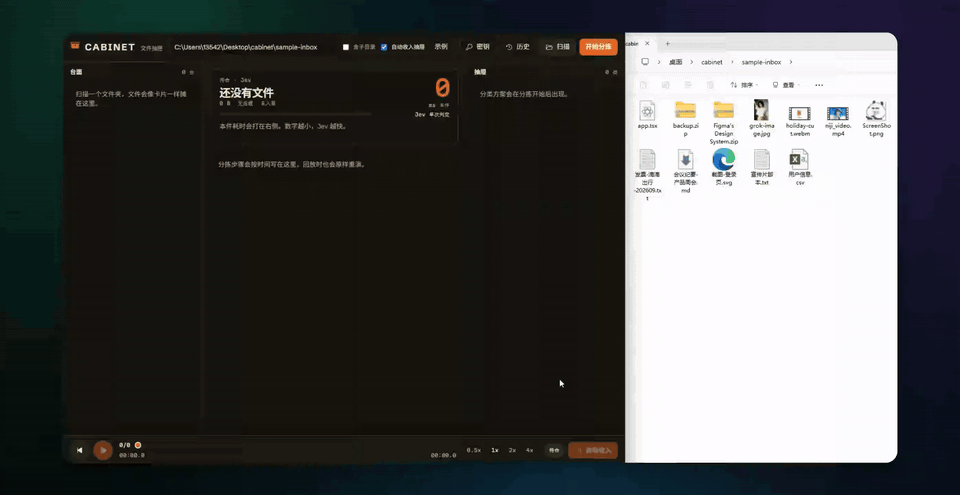

# CABINET · 文件抽匣

把一个文件夹里的文件，用 **Jev** 分类后收进对应抽屉。页面按时间记下每一步，历史可以回放，方便录屏。



DeepSeek key 已预留：填写后会先根据文件名拟定中文分类；不填则用默认抽屉。两把钥匙都不填时走演示模式（按扩展名），画面流程完整。

## 启动

需要 Node.js 20+。

```bash
cd cabinet
npm install
npm run dev
```

浏览器打开 http://localhost:5173

## 用法

1. 点右上角 **密钥**，填入 TypeSafe / Jev API Key。DeepSeek 可先留空。
2. 点 **示例** 会填入仓库里的 `examples/inbox`（虚构演示文件）。也可以换成你自己的目录，本地目录不会进 git。
3. **扫描** 预览文件，**开始分拣** 分类。默认开启 **自动收入抽屉**，分拣完会立刻移动；取消勾选则只出方案，再手动点收入。
4. 分拣台右侧大数字是本件判定耗时（毫秒），下面是平均 ms/件，用来看 Jev 有多快。
5. 底栏播放键可以按原时间轴回放这次分拣；**历史** 里能打开以前的记录。

## 钥匙怎么用

| 填写情况 | 行为 |
|---|---|
| 只有 Jev | 默认抽屉 + Jev 逐个判定 |
| Jev + DeepSeek | DeepSeek 拟定中文抽屉，Jev 把文件推进去 |
| 只有 DeepSeek | DeepSeek 拟定抽屉并分配 |
| 都空 | 演示模式，按后缀归类 |

密钥只存在浏览器 localStorage，每次请求带给本机 `localhost:8787`，不会写进仓库。分类历史在本地 `data/history.json`，同样被 git 忽略。

## 注意

- 先分拣、再移动。移动不可一键撤销，请先用示例目录试。
- Jev 主训语言是英语，判定指令用英文；中文文件名可以放在材料里。
- 仅整理所选目录下的文件。默认不递归；勾选「含子目录」后最多 4 层，并跳过 `node_modules` / `.git`。
